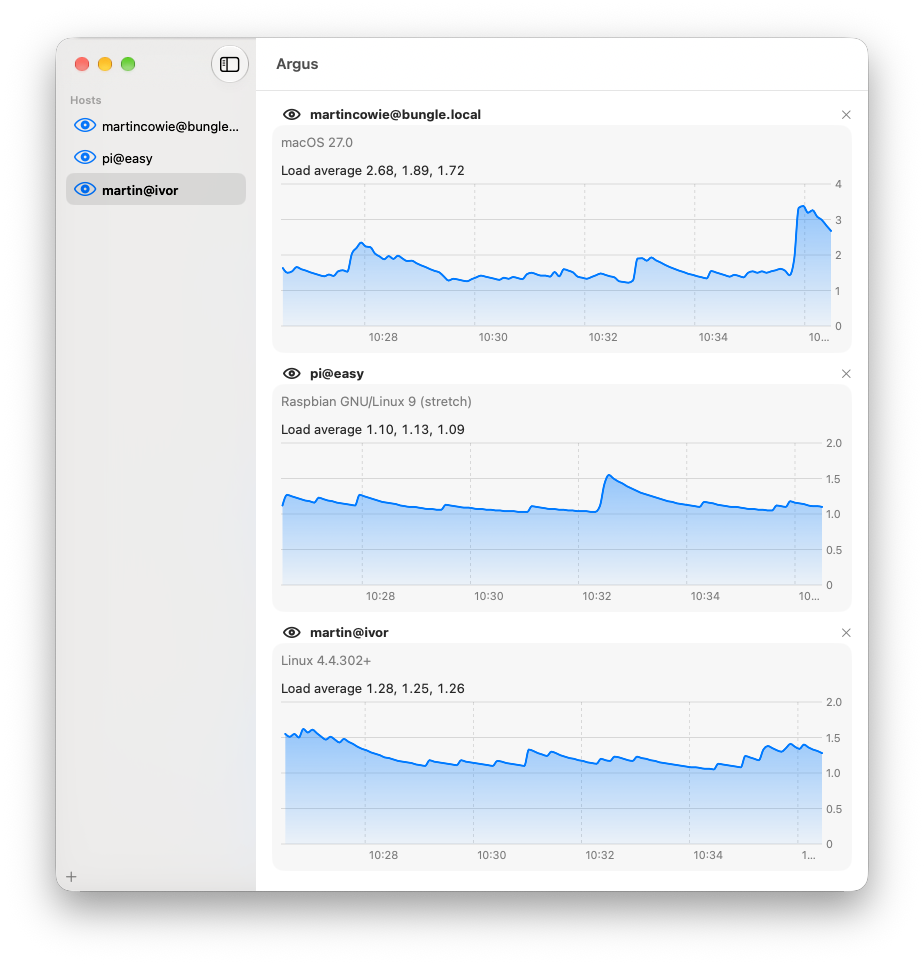

<h1></h1>

[](https://github.com/martin-cowie/argus/actions/workflows/ci.yml)

A macOS app for monitoring remote hosts over SSH.



Requires macOS 26 and Swift 6.2.

```sh
make build   # build
make test    # run the tests
make run     # launch the app
make app     # package dist/Argus.app
```
